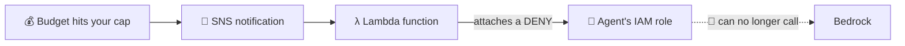

# Module 01 — Bedrock Spend Kill-Switch

**Stop an AI agent from running up your AWS bill.**

## The problem, in one minute

You give an AI agent access to Amazon Bedrock (AWS's service for running AI models). The agent gets stuck in a loop, retries forever, or someone tricks it with a malicious prompt. Either way, it keeps calling the model — and every call costs money.

Here's the catch: **Bedrock has no built-in "stop at $X" button.** AWS Budgets can *email* you when you cross a limit, but an email doesn't stop anything. By the time you read it, the money's gone.

## The fix

This module turns that budget alert into an **automatic shut-off**. When Bedrock spend crosses a number you choose (default **$300/month**), it automatically blocks the agent from calling any more models. No human needs to be awake for it to work.

It works because of one AWS rule: in IAM (AWS's permission system), **an explicit "deny" always wins over any "allow."** So the moment the deny is attached to the agent, it's cut off — instantly, mid-loop.



---

## Before you start

You need the AWS CLI and Terraform installed and logged in. See the [main README](../../README.md#what-youll-need-one-time-setup) if you haven't done that yet. You'll also need [`jq`](https://jqlang.github.io/jq/download/) for the test script (`brew install jq` on Mac).

**Cost to run this whole module: about $0.** Budgets, SNS, and Lambda are all free tier. The test that makes one real model call costs less than a cent.

---

## Quick start (copy-paste)

**Option A — you already have an AI agent with its own IAM role:**

```bash
git clone https://github.com/agentsec-aws/agentsec-aws
cd agentsec-aws/modules/01-bedrock-spend-killswitch/terraform

terraform init
terraform apply -var="agent_role_name=YOUR_ROLE_NAME" -var="monthly_cap_usd=300"
```

Replace `YOUR_ROLE_NAME` with the name of the IAM role your agent uses, and set the dollar cap you want.

**Option B — you just want to try it first (no agent needed):**

```bash
git clone https://github.com/agentsec-aws/agentsec-aws
cd agentsec-aws/modules/01-bedrock-spend-killswitch/terraform

terraform init
terraform apply -var="create_demo_agent_role=true"
```

This creates a safe throwaway role called `agentsec-demo-agent` so you can watch the whole thing work without touching anything real.

When Terraform finishes it prints a few useful values (the deny policy, an alert topic, and the exact command to undo the block). Keep that output handy.

---

## See it actually fire (without spending $300)

You don't want to spend $300 just to check your safety net works. This script proves it by sending the Lambda the *exact same signal* AWS Budgets would send for real:

```bash
cd ../demo
./run-demo.sh
```

What you'll see:

```text
==> 1/3 Bedrock call as agent role 'my-agent-role'
OK                                              ← agent works normally

==> 2/3 Budget alert fires the kill-switch
{"status": "agent disabled"}                    ← the shut-off triggers

==> 3/3 Same call again
AccessDeniedException: bedrock:InvokeModel       ← agent is now blocked 🎉
✅ Agent cut off. Kill-switch works.
```

> **Note on regions:** some AWS regions need a specific model ID. If the demo errors on the model, run it like this (Frankfurt example):
> `MODEL_ID=eu.anthropic.claude-haiku-4-5-20251001-v1:0 ./run-demo.sh`

---

## Get notified when it fires

So you actually hear about it, subscribe your email (or a Slack webhook) to the alert. Use the `ops_alert_topic_arn` value Terraform printed:

```bash
aws sns subscribe \
  --topic-arn <ops_alert_topic_arn from the terraform output> \
  --protocol email --notification-endpoint you@example.com
```

Confirm the email AWS sends you, and you're set.

---

## When it fires — what to do

The block is **deliberately not automatic to undo.** If something burned your budget, you want a human to understand *why* before turning the agent back on.

1. **Read the alert** — it tells you which role got cut off.
2. **Find the cause** — check CloudWatch and your Bedrock logs. Was it a runaway loop? A prompt-injection attack? Or just real, legitimate demand?
3. **Fix it** — patch the bug, or raise the cap if the spending was expected.
4. **Re-enable** — run the `manual_reenable_command` Terraform gave you:

```bash
aws iam detach-role-policy --role-name YOUR_ROLE_NAME \
  --policy-arn <deny_policy_arn from the terraform output>
```

---

## Clean up

Remove everything this created:

```bash
terraform destroy
```

This also lifts the block if it had fired.

---

## What gets created (for the curious)

| Resource | What it's for |
|---|---|
| `aws_budgets_budget` | Watches your Bedrock spend and triggers at your cap |
| `aws_sns_topic` | Carries the alert to the Lambda |
| `aws_lambda_function` | Attaches the deny and sends you the heads-up |
| `aws_iam_policy` (Deny) | The actual block — denies `bedrock:InvokeModel` and `Converse*` |

One nice detail: the Lambda itself is locked down. Its permissions only let it attach *this one* deny policy to *one* role — so even if it were compromised, it can't do anything else.

---

## Honest limits (please read)

This is a **safety net, not a real-time meter.** Know where it stops:

- ⏱ **AWS billing data lags 8–12 hours.** This catches sustained overspend, not a single huge spike in the first minute. For tighter control, also cap tokens per request inside your agent.
- 🎯 **It protects one named role.** Agents running as a different role aren't covered. (Module 02 will cover consolidating agent identity.)
- 🔁 **The block doesn't lift itself** when the budget resets next month — that's on purpose. You re-enable manually.

Anyone who tells you a single tool *completely* solves agent spend is skipping this section.
